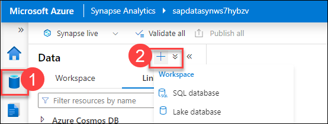
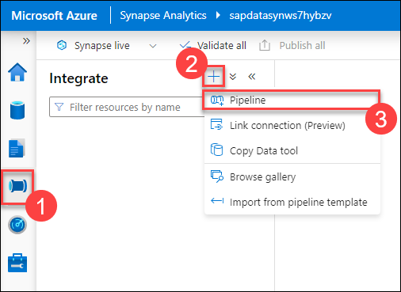

# Before the hands-on lab

## Estimated timing: 180 minutes

## Overview

In this lab, you will set up a data integration workflow in Azure Synapse Analytics. First, you'll create linked services to connect to Azure Data Lake Storage Gen2 and Azure Cosmos DB for NoSQL. Next, you'll define integration datasets to represent the source CSV data and the target Cosmos DB collection. Using these datasets, you'll build a pipeline to transfer data from the CSV file into Cosmos DB. After configuring the pipeline, you'll publish and trigger it to execute the data transfer, ensuring successful data migration and verification through the Azure Cosmos DB Data Explorer.

## Objectives

After completing this lab, you will be able to :

- Obtain the desired Azure Subscription ID value
- Create an SAP Cloud Appliance
- Deploy the Azure Resources
- Prepare sales data in SAP
- Prepare the business partner service in SAP
- Prepare payment data in Cosmos DB

### Task 1: Obtain the desired Azure Subscription ID value

In this task, you will obtain the Azure Subscription ID value needed to configure and deploy resources in your Azure environment.

1. In the top toolbar, search for and select **Subscriptions**.

    

1. On the **Subscriptions** screen, locate the desired Azure Subscription to deploy lab resources and copy the **Subscription ID** value. Save this value in a text editor for later use.

    .png "Azure Subscriptions")

### Task 2: Create an SAP Cloud Appliance

In this task, you will create an SAP Cloud Appliance by registering a new account on the SAP Cloud Appliance Library, configuring the necessary settings, and deploying an SAP S/4HANA 2023 fully-activated appliance on Microsoft Azure.

1. Using an internet browser, open the [SAP Cloud Appliance Library](https://cal.sap.com/) website.

1. Select the **Log On** button in the header of the website.

    

1. Select **Register** for creating a new account using the following details:

    - **First Name**: odluser
    - **Last Name**: <inject key="DeploymentID" enableCopy="false"></inject>
    - **Email**: <inject key="AzureAdUserEmail"></inject>
    - **Country**: United States
    - Select **Continue**
    - **Company**: Microsoft
    - **Street Address**: 123 Main Street
    - **City**: Anytown
    - **ZIP/Postal Code**: 12345
    - **Country/Region**: United States
    - Select **Continue**
    - **Password**: <inject key="AzureAdUserPassword"></inject>
    - **Re-Enter Password**: <inject key="AzureAdUserPassword"></inject>
    - Select **Register**

1. For activating the account, open **[Outlook](https://outlook.office365.com/mail/inbox/id/AAQkADljM2VkMzEwLTI2ZmUtNDlmNC1iYjA5LTBmNzlkYTY5NzJmYgAQABkSpmAaulhIiEXU2F3Yr90%3D)** on the same browser, and log in using the same credentials which you have used for registering, you will recieve an email from **SAP ID Service**, open that email, and select **Click here to activate your account**.

1. It will open the new page, on the **Account Successfully Activated** page, select **Continue**.

1. On the **Terms and Conditions** screen, read the conditions of the 30-day trial license, and select the **I Accept** button to continue.

    

1. On the SAP Cloud Appliance Library from the left navigation pane select **Appliance Templates (1)** screen, search for and locate the **SAP S/4HANA 2023, Fully-Activated Appliance (2)** item, and select the **Create Appliance** button in the search results.

    

1. On the **Terms and Conditions** screen, read the conditions, and select the **I Accept** button to continue.

1. On the **Basic Mode: Create Appliance - Account Details** screen, enter the following values, then select the **Authorize (6)** button:

    | Field | Value |
    |-------|-------|
    | Name | **SAP plus extend and innovate (1)** |
    | Description | **SAP instance for the Microsoft Cloud Workshop (2)** |
    | Cloud Provider | Select **Microsoft Azure (3)** |
    | Subscription ID | Paste the **Subscription ID (4)** value from Task 1 |
    | Authorization Type | Select **Standard Authorization (5)** |

    

1. When prompted, authenticate to Azure. If prompted, select to **Consent on behalf of your organization** and select **Accept**.

    

1. Returning to the **Basic Mode: Create Appliance** screen fill the **Appliance Details** form as follows and select **Create**:

    | Field | Value |
    |-------|-------|
    | Name  | MS-SAP |
    | Region | Select the nearest location |
    | Password | Choose a strong password |
    | Retype Password | Enter the chosen password |

    >**Note**: If difficulty arises using the **Basic** mode, an alternative is to use **Authorization with Application Type** using a [service principal](https://docs.microsoft.com/azure/active-directory/develop/howto-create-service-principal-portal).

    >**Note:** Select **Proceed** on the **Warning** pop-up.

1. On the **Private Key** modal, select to **Store** the private key in the SAP Cloud Appliance Library. Check the **Encrypt the private key with a password** and enter a **Password**: <inject key="AzureAdUserPassword"></inject>. Type the password once more in the **Retype Password** textbox. Select the **Download** button to download the encrypted key.

    

    >**Note:** Close the **Warning** pop-up.

1. The deployment  will take approximately 90 minutes. The status will update on the Instances screen. Once complete, the status will indicate **Active**.

    

### Task 3: Deploy the Azure Resources

In this task, you will deploy the required Azure resources using Terraform Infrastructure as Code by running commands in Azure Cloud Shell with the PowerShell environment.

This lab utilizes Terraform Infrastructure as Code to deploy the necessary Azure resources.

1. Use the **[\>_]** button to the right of the search bar at the top of the page to create a new Cloud Shell in the Azure portal, and select ***PowerShell*** environment.
    
    

    
   
1. In the **Getting Started** menu,choose **No storage account required (1)**,select your default **Subscription (2)** from the dropdown and click on **Apply (3)**

   

1. Note that Cloud Shell can be resized by dragging the separator bar at the top of the pane, or by using the—, **&#9723;**, and **X** icons at the top right of the pane to minimize, maximize, and close the pane. For more information about using the Azure Cloud Shell, see the [Azure Cloud Shell documentation](https://docs.microsoft.com/azure/cloud-shell/overview).
  
1. In the Cloud Shell pane, ensure the PowerShell language is selected. Clone the source code repository by issuing the following command.

    ```PowerShell
    git clone https://github.com/CloudLabsAI-Azure/SAP-plus-extend-and-innovate-with-Data-and-AI.git
    ```

1. Navigate to the Terraform directory by executing the following command:

    ```PowerShell
    cd 'SAP-plus-extend-and-innovate-with-Data-and-AI/Hands-on lab/Resources/terraform'
    ```

1. Set the desired subscription by executing the following code, replace **SUBSCRIPTION_ID** with the value you recorded earlier in the lab setup.

    ```PowerShell
    az account set --subscription SUBSCRIPTION_ID
    ```

1. Establish a user context by executing the following command. Follow the prompts to authenticate to the Azure Cloud Shell.

    ```PowerShell
    az login
    ```

1. Initialize the Terraform code using the following command:

    ```PowerShell
    terraform init
    ```

1. Deploy the lab resources by executing the following command. When prompted to perform the actions, type `yes` and press <kbd>Enter</kbd>. It will take approximately 15 minutes for the deployment to complete.

    ```PowerShell
    terraform apply
    ```

    >**Note:** Wait for the script to finish; it will take approximately 10-15 minutes. If there are any errors, please ignore them and proceed with the lab.

1. Close the Cloud Shell panel if desired.

### Task 4: Prepare sales data in SAP

In this task, you will create a sales view in SAP, expose it as an OData service, and enable consumption by external services. The process includes connecting to your SAP instance via the SAP Cloud Appliance Library, using SAP Development Tools for Eclipse to define and activate the sales view, and configuring the OData service in SAP GUI.

This task demonstrates creating a sales view in SAP and exposing it as an OData service for consumption by external services.

1. On the SAP Cloud Appliance Library Instances page, select the **Connect** button on the **SAP** row.

    

2. On the **Connect to the instance** dialog, select the **Connect** link on the RDP row. This will download an RDP file.

    

3. Open the downloaded RDP file and log into the instance using the username `Administrator` and the password used when deploying the instance.

    >**Note:** Minimize the **Welcome** page.

4. From the desktop double-click the **SAP Dev Tools for Eclipse** PowerShell icon to install Eclipse. Accept the Terms and Conditions agreement. Installation can take up to 10 minutes, please be patient.

    >**Note**: The Eclipse IDE will open while the SAP tools are installed, let it run to completion.

   

   >**Note:** Once the installation complete, select **OK**.

5. Once the installation has completed, double-click the **SAP Dev Tools for Eclipse** icon. This will open the Eclipse development environment.

    

    >**Note:** If you see a dialog box for the secure storage indicates Password hint required, select **No**.

    

6. In the **Select a directory as workspace** dialog, keep the default value and select **Launch**. Launching will take a few moments, please be patient.

    >**Note**: You may see a dialog for the workspace that indicates an older workspace, if this is the case, accept the current workspace instead of creating a new one.

    

7. Change the perspective to development by expanding the **Window (1)** menu, **Perspective (2)**, **Open Perspective (3)**, then selecting the **SAP HANA Development (4)** item.

    

8. In the left panel, select the **Project Explorer** tab then double-click the **S4H_100_s4h_ext_en** folder.

    

9. When prompted for a password, enter `Welcome1` and select **OK**.

    

10. Expand the **File (1)** menu, then **New (2)** and select the **Other (3)** item.

    

11. In the **Select a wizard** dialog, search for `Data Definition`. Select the **Data Definition (1)** item beneath the **ABAP / Core Data Services (2)** folders. Select **Next (3)**.

    

12. Fill in the **New Data Definition** dialog as follows, then select **Finish**.

    | Field | Value |
    |-------|-------|
    | Project | Retain the default **S4H_100_s4h_ext_en**. |
    | Package | Enter `$TMP` |
    | Name | Enter `ZBD_ISalesDocument_E` |
    | Description | Enter `ZBD_ISalesDocument_E` |

    

13. Replace the code listing for **ZBD_ISALESDOCUMENT_E** with the following. Save the file.

    ```SAP
    @AbapCatalog.sqlViewName: 'ZBD_ISALESDOC_E'
    @AbapCatalog.compiler.compareFilter: true
    @AbapCatalog.preserveKey: true
    @AccessControl.authorizationCheck: #CHECK
    @EndUserText.label: 'Expanded CDS for Extraction I_Salesdocument'
    define view ZBD_I_Salesdocument_E as select from I_SalesDocument {
    key SalesDocument,
        //Category
        SDDocumentCategory,
        SalesDocumentType,
        SalesDocumentProcessingType,

        CreationDate,
        CreationTime,
        LastChangeDate,
        //@Semantics.systemDate.lastChangedAt: true
        LastChangeDateTime,

        //Organization
        SalesOrganization,
        DistributionChannel,
        OrganizationDivision,
        SalesGroup,
        SalesOffice,
        
        //SoldTo
        SoldToParty,
        _SoldToParty.CustomerName,
        _SoldToParty.Country,
        _SoldToParty.CityName,
        _SoldToParty.PostalCode,
        _SoldToParty.CustomerAccountGroup,
        
        //SalesDistrict
        SalesDistrict,
        
        CustomerGroup,
        CreditControlArea,
        PurchaseOrderByCustomer,
        
        //Pricing
        TotalNetAmount,
        TransactionCurrency,
        PricingDate,
        //RetailPromotion,
        //PriceDetnExchangeRate,
        //SalesDocumentCondition,
        
        //Billing
        BillingDocumentDate,
        BillingCompanyCode
    } where SDDocumentCategory = 'C'
    ```

14. Right-click in the whitespace of the **ZBD_ISALESDOCUMENT_E** view code window and select **Activate**.

    

15. Right-click in the whitespace of the **ZBD_ISALESDOCUMENT_E** view once more, this time select **Open With (1)** and choose **Data Preview (2)**. This will display the raw data of the view. After reviewing the data, you can close this preview.

    

    

16. Next, expose SAP sales data as an OData service. Add the following code immediately preceding the `define view` line of code of the **ZBD_ISALESDOCUMENT_E** file and save the file.

    ```ABAL
    @OData.publish: true
    ```

    

17. Right-click in the whitespace of the **ZBD_ISALESDOCUMENT_E** file and select **Activate**.

18. Minimize the Eclipse development environment and double-click the **SAP Logon** icon located on the desktop of the virtual machine. This will open the SAP GUI application.

    

19. From the top toolbar menu, select the **Log On** button.

    

20. Log in with the username `S4H_EXT` and the password `Welcome1`, press <kbd>Enter</kbd> to submit the form.

    

21. Once logged on, type `/n/IWFND/MAINT_SERVICE` in the toolbar menu transaction combo box and press <kbd>Enter</kbd>. This opens the **Activate and Maintain Services** window.

      

22. From the toolbar menu of the **Activate and Maintain Services** window, select the **Add Service** button.

    

23. Populate the **Add Selected Services** filter form as follows, and press <kbd>Enter</kbd>.

    | Field | Value |
    |-------|-------|
    | System Alias | Enter `Local` |
    | Technical Service Name | Enter `ZBD_*` |

    

24. From the list of results, select the **ZBD_I_SALESDOCUMENT_E_CDS** item.

    

25. In the **Add Service** dialog, select the **Local Object** button located in the **Creation Information** section. This will populate the **$TMP** value, and press <kbd>Enter</kbd>. An information dialog indicating success will display, dismiss this dialog.

    

26. On the **Add Selected Services** screen, select the **Back** button on the toolbar menu. This will open the **Activate and Maintain Services** window once more.

    

27. On the **Activate and Maintain Services** screen, select the **Filter** button from the toolbar menu.

    

28. In the **Filter for Service Catalog** dialog, type `ZBD_*` in the **Technical Service Name** field and press <kbd>Enter</kbd>.

    

29. This action filters the **Activate and Maintain Services** screen to a single service. In the **ICF Nodes** pane, select the **SAP Gateway Client** button. If the **SAP GUI Security** dialog displays, check the **Remember My Decision** checkbox and select **Allow**.

    

30. On the **SAP Gateway Client** window, select the **Execute** button from the toolbar menu. This tests the OData service, check the **Remember My Decision** checkbox and select **Allow**. Verify in the **HTTP Response** pane that the status code indicates **200**.

    

31. On the **SAP Gateway Client** window, select the **Entity Set** button on the toolbar menu.

    

32. On the **EntitySets** dialog, double-click the **ZBD_I_Salesdocument_E** item, check the **Remember My Decision** checkbox and select **Allow**.

    

33. On the **SAP Gateway Client** window, select **Execute**. This service retrieves the sales documents via the OData endpoint. Verify the HTTP Response status code value is **200**.

    

34. On the **SAP Gateway Client** window, select the **Back** button to return to the **Activate and Maintain Services** screen.

35. On the **ICF Node** pane, select the **Call Browser** button. This will bring up the **Security GUI** dialog once more. Copy the URL value for future use in the lab. After recording the value, close the dialog by selecting the **X** button on the upper right corner of the dialog window. This URL is the service endpoint for the sales document OData service.

    

### Task 5: Prepare the business partner service in SAP

In this task, you'll update a Business Partner record in SAP to ensure the company name matches the imported Sales data. This involves activating and maintaining the relevant service in SAP, accessing the SAP Gateway Client to retrieve data, and using Postman to update the company name of a Business Partner record.

A service is available that allows for the update of a Business Partner record. A Business Partner record is where non-paying entities are flagged in the system. This service does not have company names that match what is imported from the Sales data. This task updates the company name of a record in SAP for use in the lab.

1. In the SAP UI, access the Activate and Maintain Service transaction by typing `/n/IWFND/MAINT_SERVICE` in the toolbar menu transaction combo box and press <kbd>Enter</kbd>. This opens the **Activate and Maintain Services** window.

      

<!-- 2. From the toolbar menu of the **Activate and Maintain Services** window, select the **Add Service** button.

    

3. Populate the **Add Selected Services** filter form as follows, and press <kbd>Enter</kbd>. Close the **Information** pop-up.

    | Field | Value |
    |-------|-------|
    | System Alias | Enter `Local` |
    | Technical Service Name | Enter `*GWSAMPLE*` |

     -->

<!-- 4. From the list of results, select the **/IWBEP/GWSAMPLE_BASIC** item.

    

5. In the **Add Service** dialog, select the **Local Object** button located in the **Creation Information** section. This will populate the **$TMP** value, and press <kbd>Enter</kbd>. An information dialog indicating success will display, dismiss this dialog.

    

6. On the **Add Selected Services** screen, select the **Back** button on the toolbar menu. This will open the **Activate and Maintain Services** window once more.

     -->

1. On the **Activate and Maintain Services** screen, select the **Filter** button from the toolbar menu.

    

1. In the **Filter for Service Catalog** dialog, type `*GWSAMPLE*` in the **Technical Service Name** field and press <kbd>Enter</kbd>.

    

1. This action filters the **Activate and Maintain Services** screen to a single service. In the **ICF Nodes** pane, select the **SAP Gateway Client** button. If the **SAP GUI Security** dialog displays, check the **Remember My Decision** checkbox and select **Allow**.

    

1. On the **SAP Gateway Client** window, select the **Entity Set** button on the toolbar menu.

    

1. On the **EntitySets** dialog, double-click the **BusinessPartnerSet** item.

    

1. On the **SAP Gateway Client** window, select **Execute**. This service retrieves the sales documents via the OData endpoint. Verify the HTTP Response status code value is **200**.

    

1. On the **SAP Gateway Client** window, select the **Back** button to return to the **Activate and Maintain Services** screen.

1. On the **ICF Node** pane, select the **Call Browser** button. This will bring up the **Security GUI** dialog once more. Copy the URL value for future use in the lab. After recording the value, close the dialog by selecting the **X** button on the upper right corner of the dialog window. This URL is the service endpoint for the Business Partner OData service. 

    

    >**Note:** Minimize the RDP window.

1. Next, obtain the IP Address for the MSSAP-SAP1 virtual machine. In the [Azure Portal](https://portal.azure.com), enter `MSSAP-SAP1` (1) in the search box located in the top toolbar and select the **MSSAP-SAP1 (2)** virtual machine from the filtered list of resources.

    

1. On the **MSSAP-SAP1** virtual machine Overview screen, copy the IP address and record it for future use.

    

    >**Note**: This IP address can change, it does not have a static IP. Please obtain the current IP address.

1. Open a new tab in the browser, download [Postman](https://www.postman.com/downloads/) for **Windows 64-bit**. Open the downloaded the file. It will start the installation process.

1. Enter the following details:

    - **Work email**: <inject key="AzureAdUserEmail"></inject>
    - Select **Create Free account**
    - **Username**: **odluser<inject key="DeploymentID" enableCopy="false"/>**
    - **Password**: <inject key="AzureAdUserPassword"></inject>
    - **Verify you are human**: Select the checkbox
    - Select **Create Free Account**

        >**Note:** Select **Open** on the pop-up.

1. Open Postman on your local machine and provide **Your name** as **odluser<inject key="DeploymentID" enableCopy="false"/>** **(1)** and select any of the role from the list (2). Click on **Continue (3)**.

    

1. In the main pane select **Import** from the Workspace toolbar to import a collection.

    

1. On the Import dialog, then enter the following URL.

    ```text
    https://raw.githubusercontent.com/CloudLabsAI-Azure/SAP-plus-extend-and-innovate-with-Data-and-AI/MS-Innovation/Hands-on%20lab/Resources/postman/SAP%20MCW.postman_collection.json
    ```


1. In the Postman Collections list, select the **SAP MCW (1)** collection. Select the **Variables (2)** tab and enter the MCWSAP-SAP1 IP address in the **INITIAL VALUE (3)** and **CURRENT VALUE (4)** column. Select **Save (5)** on the collection.

    

1. Expand the SAP MCW Collection and select the **GET Company** request. Select **Send**. Notice how the CompanyName is currently **Office Line Prag**.

    

1. In the SAP MCW Collection, select the **Patch Company** request and select **Send**. The response should show the status of **204 No Content**.

    

1. Return to the **GET Company** request and select **Send**. Notice how the CompanyName now shows **Bigmart**.

    

1. Retain this collection in Postman for use during the hands-on lab.

### Task 6: Prepare payment data in Cosmos DB

Raw payment data is available in Azure Data Lake storage. This task walks through loading raw payment data into Cosmos DB by leveraging Azure Synapse Analytics. First, linked services are created, these act as the connection strings to external compute resources. Next, integration datasets are created, these indicate the location and shape of the data being used in the migration. Finally, a pipeline is created to orchestrate moving data from Azure Data Lake Storage Gen2 to Cosmos DB.

In this task, you will create linked services in Azure Synapse Analytics for Azure Data Lake Storage Gen2 and Azure Cosmos DB for NoSQL. You'll then define integration datasets to represent your source (CSV data) and sink (Cosmos DB collection). Finally, you'll build a pipeline to transfer data from the CSV file to Cosmos DB, publish the pipeline, and trigger it to run.

#### Step 1: Create linked services in Azure Synapse Analytics

1. Navigate to the [Azure Portal](https://portal.azure.com), open the **mcw_sap_plus_extend_and_innovate** resource group.

2. From the list of resources, locate and select the Synapse Workspace item named **sapdatasynws{SUFFIX}**.

3. On the Synapse workspace screen, select **Open Synapse Studio**.

    

4. In Synapse Studio, select the **Manage** hub from the left menu.

    

5. Beneath the **External connections** section, select **Linked services**. Then select **+ New** from the Linked services toolbar menu.

    

6. In the New linked service blade, search for and select **Azure Data Lake Storage Gen2**. Select **Continue**.

      

7. In the New linked service - Azure Data Lake Storage Gen2 form, fill it in as follows and select **Create (5)**. Unspecified fields retain their default values.

    | Field | Value |
    |-------|-------|
    | Name | Enter `datalake` **(1)** |
    | Authentication type | Select **System-assigned managed identity** **(2)** |
    | Azure subscription | Select your Azure subscription **(3)** |
    | Storage account name | Select **sapadls{SUFFIX}** **(4)** |

    

8. On the Linked services screen, select **+ New** from the toolbar menu. On the New Linked service blade search for and select **Azure Cosmos DB for NoSQL**. Select **Continue**.

    

9. In the New linked service - Azure Cosmos DB for NoSQL form, fill it in as follows, then select the **Create** button. Unspecified fields retain their default values.

    | Field | Value |
    |-------|-------|
    | Name | Enter `payment_data_cosmosdb` |
    | Authentication type | Select **Account key** |
    | Azure subscription | Select your Azure subscription |
    | Azure Cosmos DB account name | Select **sap-mcw-cosmos-{SUFFIX}** |
    | Database name | Select **SAPS4D** |

    .png "New Cosmos DB Linked service form")

10. On the Synapse Studio toolbar menu, select **Publish all**. Select **Publish** on the verification blade.

    

#### Step 2: Create source and sink integration datasets

The source data is payment data that is located in Azure Data Lake Storage Gen2 in CSV format. The sink is the paymentData Cosmos DB collection.

1. In Synapse Studio, select the **Data** hub.

   

2. From the center pane, select the **Linked (1)** tab. Expand the **Azure Data Lake Storage Gen2 (2)** item, followed by the **datalake (3)** item, and select the **payment-data-csv (4)** container. From the **payment-data-csv** tab, select the **paymentData_CAL2021.csv (5)** file. Next, select **New integration dataset (6)** from the toolbar menu.

    >**Note**: If you do not see **datalake** in the **Azure Data Lake Storage Gen2** items, you may need to refresh.

    

3. On the New integration dataset blade, enter `payment_data_csv` for the name and select **DelimitedText** for the format. Select **Create**.

    

4. On the **payment-data-csv** integration dataset tab, change the **Column delimiter** value to **Semicolon (;)** and check the checkbox for the **First row as header** field.

   

5. If desired, select the **Preview data** button to view a sample of the data.

6. Remaining in the Data hub, expand the **+** menu in the center pane and select **Integration dataset** beneath the **Linked** header.

    

7. On the New integration dataset blade, search for and select **Azure Cosmos DB for NoSQL**. Select **Continue**.

    

8. On the **Set properties** blade, fill the form as follows, then select **OK**.

    | Field | Value |
    |-------|-------|
    | Name | Enter `payments_cosmosdb` |
    | Linked service | Select **payment_data_cosmosdb** |
    | Container | Select **paymentData** |
    | Import schema | Select **None** |

    

9. On the Synapse Studio toolbar menu, select **Publish all**. Select **Publish** on the verification blade.

#### Step 3: Create pipeline to ingest payment data into Cosmos DB

1. In Synapse Studio, select the **Integrate** hub from the left menu. Then from the center pane menu, expand the **+** button and choose **Pipeline**.

    

2. In the **Properties** blade of the new pipeline, set the name field to **UploadPaymentsToCosmosDB**. If desired, press the **Properties** button in the pipeline toolbar to collapse this blade.

    

3. In the Activities pane, expand the **Move & Transform** item then drag and drop a **Copy data** activity to the pipeline canvas.

    

4. With the Copy data activity selected in the pipeline editor, select the **Source** tab. Select **payment_data_csv** as the **Source dataset**.

    

5. With the Copy data activity selected in the pipeline editor, select the **Sink** tab. Select **payments_cosmosdb** as the Sink dataset.

    

6. On the Synapse Studio toolbar menu, select **Publish all**. Select **Publish** on the verification blade.

    

7. Once published, expand the **Add trigger** toolbar item and choose **Trigger now**. Select **OK** on the Pipeline run blade. This will run the pipeline to copy the payments data to Cosmos DB.

    

8. In Synapse Studio, select the **Monitor** hub. Beneath the Integration header of the center pane, select **Pipeline runs**. Monitor the payments pipeline run until it has completed. The Refresh button in the toolbar may be used to update the monitoring table.

    

9. Verify the data by returning to the Azure Portal, opening the **mcw_sap_plus_extend_and_innovate** resource group, then locating and opening the **sap-mcw-cosmos-{SUFFIX}** Cosmos DB resource.

10. On the Azure Cosmos DB account screen, select **Data Explorer** from the left menu. In the SQL API panel, expand the **SAPS4D** and **paymentData**. Select **Items** tab. This will display the contents of the selected document for review.

    

You should follow all steps provided *before* performing the Hands-on lab.

## Summary

In this lab, you configured data integration in Azure Synapse Analytics by creating linked services for Azure Data Lake Storage Gen2 and Azure Cosmos DB. You set up integration datasets for the source CSV file and the Cosmos DB target collection. A pipeline was created to move data from the CSV file into Cosmos DB. After setting up and publishing the pipeline, you triggered it to run and monitored the data transfer, verifying the results in Azure Cosmos DB.

## You have successfully completed this exercise. Select **Next >>** to proceed to the next one.
