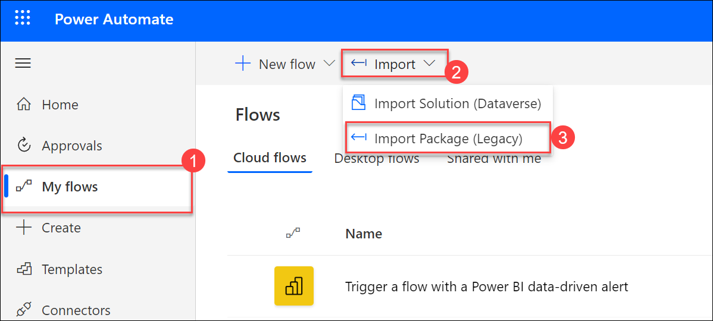

## Exercise 10: Update SAP from Power BI

### Estimated Duration: 30 minutes

## Lab Scenario

Contoso Retail requires a method to identify and flag risky customers in their SAP system whose payments are consistently delayed. In this exercise, a Power Automate flow is integrated into the Power BI report to automate this process. This flow is designed to detect late payments and trigger a business partner update in SAP using OData. By linking Power BI with SAP through this automated workflow, Contoso can streamline their risk management and ensure timely updates to their customer records.

## Lab Objectives

After completing this lab, you will be able to:

- Task 1: Import a Power Automate flow
- Task 2: Add a Power Automate visual and trigger the flow from Power BI

### Task 1: Import a Power Automate flow

In this task, you will import a Power Automate flow from a downloaded ZIP file into Power Automate. You will review and configure the imported flow by setting up necessary connections and replacing specific values, such as the IP address of the SAP virtual machine. After saving your changes, you will activate the flow to ensure it is ready for use in future tasks.

1. In a web browser, access the following link and select the download icon to download the UpdateBusinessPartnerFromPowerBI.zip file. This file contains the exported flow that is used in this exercise.

    ```text
    https://github.com/CloudLabsAI-Azure/SAP-plus-extend-and-innovate-with-Data-and-AI/blob/MS-Innovation/Hands-on%20lab/Resources/powerautomate/UpdateBusinessPartnerFromPowerBI.zip
    ```

    

2. Access and log into [Power Automate](https://make.powerautomate.com).

3. From the left menu, select **My flows (1)**. Expand the **Import (2)** menu item on the toolbar menu and select **Import Package (Legacy) (3)**.

    

4. On the Import package screen, select the **Upload** button then choose to upload the file that was downloaded in the first step of this task: **UpdateBusinessPartnerFromPowerBI.zip**. The file will automatically start uploading.

    

5. In the Import package review screen, select the wrench icon next to the Power BI Connection under the Related resources section.

   

6. On the Import Setup blade, choose the Power BI user account utilized during this lab and select **Save**.

7. Select **Import** to complete the import of the flow.

    

8. A message indicating the successful import will display at the top of the screen. Select the **Open flow** link from this message.

    

9. On the flow design canvas, expand the second step **Initialize variable** and replace the Value field with the IP address of the MSSAP-SAP1 virtual machine. Select **Save** from the toolbar menu. Refer to the [Before the hands-on lab Task 5](Before%20the%20HOL%20-%20SAP_plus_extend_and_innovate_with_data_and_ai.md#task-5-prepare-the-business-partner-service-in-sap) steps 15 and 16 for guidance.

    

    >**Note**: This flow initiates a get request to the SAP service to retrieve a business partner by name using the CUSTOMERNAME value passed in by Power BI. This request also requests an X-CSRF-Token that will allow the current session to perform an update. The last HTTP call issues the update of the business partner record found in the first HTTP activity to 02, indicating a risky customer.

10. Select the back arrow icon next to the Update Business Partner from the Power BI title in the toolbar.

    

11. On the Flows &gt; Update Business Partner from Power BI screen, select **Turn on** from the toolbar menu.

    

12. Keep this screen open for a future task.

### Task 2: Add a Power Automate visual and trigger the flow from Power BI

In this task, you will add a Power Automate visual to your Power BI report and configure it to trigger a flow. After inserting and configuring the visual, you will test the flow by selecting a customer and running the flow, then verify the update in SAP.

1. Access and log into **Power BI Desktop**.

2. Open the report from the earlier exercises, which you have saved as **sap.pbix**.

3. In the online Power BI report editor in the web browser, select the **Edit** button from the top toolbar menu.

    

4. From the Visualizations panel, select the **Table** item. Drag-and-drop the **SalesOrderPayments** > **CUSTOMERNAME** to the Columns box.

   

5. Ensure no other visualization is selected, then choose the **Power Automate** item from the Visualizations panel. Drag-and-drop the **SalesOrderPayments** > **CUSTOMERNAME** to the Power Automate data box.

    

6. Expand the ellipsis menu on the Power Automate visualization on the report and select **Edit**.

    

7. On the Microsoft Power Automate screen, select the **Update Business Partner from Power BI** flow then choose **Apply** on the toolbar menu. Once applied, select the **Back to report** link at the top of the screen.

   

8. Select **Save** then **Reading view** from the report toolbar menu.

    

9. Switch to the Postman application, and issue the **GET Customer** request from the SAP collection. Refer to the [Before the hands-on-lab](Before%20the%20HOL%20-%20SAP_plus_extend_and_innovate_with_data_and_ai.md#task-5-prepare-the-business-partner-service-in-sap) step 17 through 21 for guidance if necessary. Make note that in the response, the **BusinessPartnerRole** indicates **01** for **Bigmart** - this indicates a customer in good standing.

    

10. Switch back to the Power BI report, from the CUSTOMERNAME table, select **Bigmart**. This will filter the report visualizations by that customer.

    

11. Select the **Run flow** button (anywhere in the blue area), and the Update Business Partner from Power BI flow will be triggered.

    

12. Return to the Power Automate Update Business Partner from the Power BI flow screen (left open in Task 1). The history displays the status of the run as successful. Optionally, drill into the Date link beneath the Start header to view the run details.

    

13. Switch back to the Postman application, and issue the **GET Customer** request from the SAP collection. Notice how the BusinessPartnerRole value now indicates **02**. This role indicates this customer is now flagged as a risky customer in SAP.

    

## Summary

In this exercise, you have imported a Power Automate flow and added a Power Automate visual to your Power BI report. You then configured the visual to trigger the flow directly from Power BI, allowing for seamless integration and automation between your reports and the workflow processes.

## You have successfully completed this exercise.
