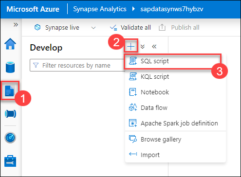
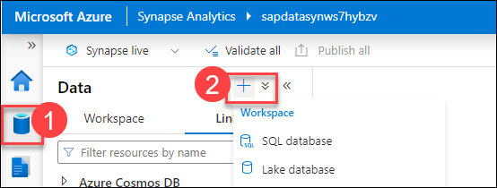
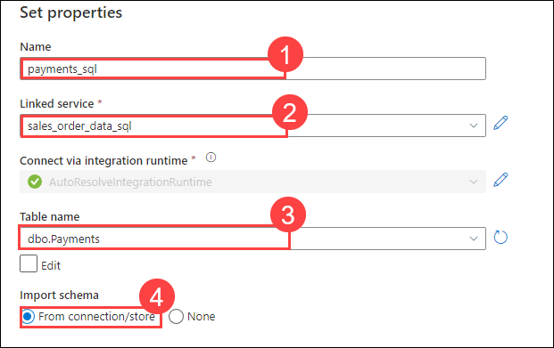
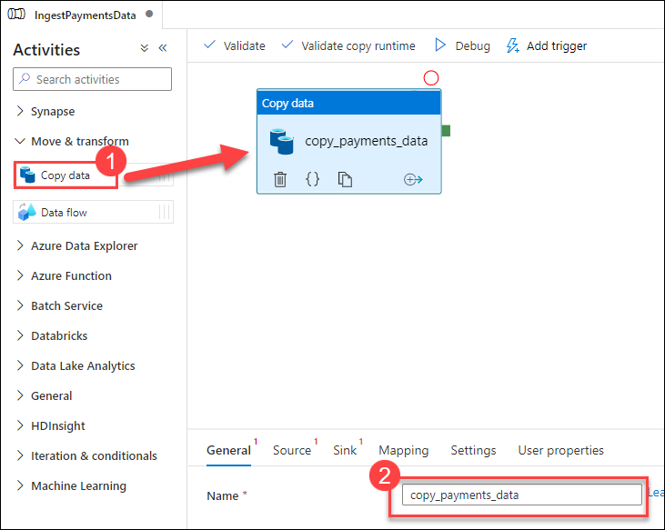
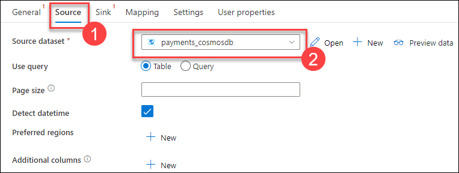
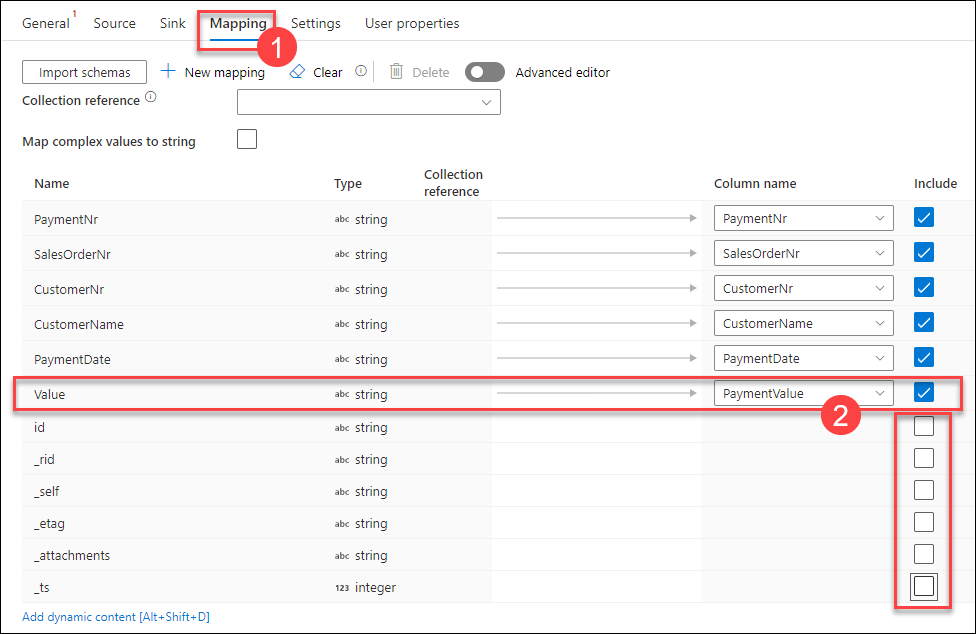

## Exercise 3: Ingest payment information from Cosmos DB into Azure Synapse Analytics

### Estimated Duration: 30 minutes

## Lab Scenario

Payment history data is required when creating the cash flow prediction model. This data resides in Cosmos DB. In this exercise, a pipeline is created to move payment history data from a Cosmos DB collection into a table in a dedicated SQL pool in Azure Synapse Analytics. In the steps taken in Before the hands-on lab steps, a linked service for Cosmos DB (payment_data_cosmosdb) and an integration dataset for the paymentData collection (payments_cosmosdb) were created. These assets will be reused in this exercise to implement the payment ingestion pipeline.

## Objectives

After completing this lab, you will be able to:

- Create a dedicated SQL pool table to hold payment information
- Create the Payments table integration dataset
- Create the Payments ingestion pipeline

### Task 1: Create a dedicated SQL pool table to hold payment information

In this task, you will create a dedicated SQL pool table to store payment information. You will start by opening a new SQL script in Synapse Studio and connecting to the sapdatasynsql database. Next, you will run a SQL command to create the Payments table with specified columns for payment details.

1. In Synapse Studio, select the **Develop** hub from the left menu, then expand the **+** menu from the center pane and choose **SQL script**.

    

2. In the SQL script tab, choose to connect to the **sapdatasynsql** dedicated SQL pool.

    

3. In the SQL script editor, paste and run the following SQL command to create the Payments table. The Run button is located in the SQL script toolbar menu.

    ```SQL
    CREATE TABLE Payments(
        PaymentNr nvarchar(10),
        SalesOrderNr nvarchar(10),
        CustomerNr nvarchar(10),
        CustomerName nvarchar(80),
        PaymentDate date,
        PaymentValue decimal(15,2),
        Currency nvarchar(5)
    )
    ```

### Task 2: Create the Payments table integration dataset

In this task, you will create an integration dataset for the Payments table. Begin by opening a new integration dataset in Synapse Studio and selecting Azure Synapse Analytics as the dataset type. Fill in the required properties, linking it to the sales_order_data_sql service and selecting the dbo.Payments table. Finally, publish the integration dataset to make it available for use.

1. In Synapse Studio, select the **Data** hub from the left menu and expand the **+** menu in the center pane. Select **Integration dataset**.

    

2. In the New integration dataset blade, search for and select **Azure Synapse Analytics**. Select **Continue**.

    

3. On the **Set properties** blade, populate the form as follows and select **OK**.

    | Field | Value |
    |-------|-------|
    | Name | Enter `payments_sql` |
    | Linked service | Select **sales_order_data_sql** |
    | Table name | Select **dbo.Payments** |
    | Import schema | Select **From connection/store** |

    

4. On the Synapse Studio toolbar menu, select **Publish all**. Select **Publish** on the verification blade.

    

### Task 3: Create the Payments ingestion pipeline

In this task, you will create a pipeline to ingest payment data. Add a Copy data activity to the pipeline, configure it with payments_cosmosdb as the source and payments_sql as the sink. Adjust the mappings, enable staging, and then publish and trigger the pipeline. Monitor its progress and verify successful data ingestion by querying the Payments table.

1. In Synapse Studio, select the **Integrate** hub from the left menu. Expand the **+** menu from the center pane and choose **Pipeline**.

    

2. In the Properties blade, enter the name `IngestPaymentsData`. Optionally collapse the Properties blade using the button on the toolbar of the pipeline.

    

3. From the Activities menu, expand the **Move & transform** section then drag-and-drop a **Copy data** activity to the pipeline visual canvas. With the Copy data activity selected, enter **copy_payments_data** in the **Name** field.

    

4. With the **copy_payments_data** Copy data activity selected, select the **Source** tab. Select **payments_cosmosdb** as the **Source dataset**.

    

5. With the **copy_payments_data** Copy data activity selected, select the **Sink** tab. Select **payments_sql** as the Sink dataset.

6. With the **copy_payments_data** Copy data activity selected, select the **Mapping** tab. Select the **Import schemas** button.

    

7. On the Mapping tab, locate the field with the name **Value**, and use the dropdown to assign it to the Column name **PaymentValue**. Uncheck the **Include** checkboxes for the **id** field as well as all the fields whose name is prefixed with an underscore (_).

    

8. With the **copy_payments_data** Copy data activity selected, select the **Settings** tab. Check the **Enable staging** checkbox, then select **datalake** for the **Staging account linked service** and enter `staging` in the **Storage Path** field.

    

9. On the Synapse Studio toolbar menu, select **Publish all**. Select **Publish** on the verification blade.

    

10. Once published, expand the **Add trigger** item on the pipeline toolbar and select **Trigger now**. Select **OK** on the Pipeline run blade.

    

11. On the left menu of Synapse Studio, select the **Monitor** hub. Ensure **Pipeline runs** is selected from the center menu. Observe the IngestPaymentsData pipeline status over time. Use the **Refresh** button to update the table.

    

12. Upon successful completion of the pipeline run, verify data was copied by accessing the **Develop** hub from the left menu, expanding the **+** menu and selecting **SQL script**. In the **Connect to** field of the SQL script, select **sapdatasynsql**. In the query window, paste the following SQL command and run the query. Ensure the value returned is non-zero.

    ```sql
    select count(*) from Payments;
    ```
## Summary

In this exercise, you have created a dedicated SQL pool table for payment information, established an integration dataset for the Payments table in Azure Synapse Analytics, and built a pipeline to ingest payment data from a source into the dedicated SQL pool. This process involved setting up the necessary infrastructure, configuring data movement activities, and verifying successful data ingestion.

## You have successfully completed this exercise. Select **Next >>** to proceed to the next one.