## Exercise 5: Train a regression model to predict incoming cashflow using Azure Machine Learning Studio

### Estimated Duration: 50 minutes

## Lab Scenario

In this exercise, you will learn how to connect Azure Machine Learning to sales data stored in Azure Data Lake Storage. You will then use this connection to train a predictive model aimed at forecasting incoming cash flow, leveraging the robust capabilities of Azure Machine Learning for data analysis and prediction.

## Lab Objectives

After completing this lab, you will be able to:

- Task 1: Retrieve the access key for the Azure Data Lake Storage account
- Task 2: Create an Azure Machine Learning datastore
- Task 3: Create and run an Automated ML job
- Task 4: Deploy the best model as a web service

### Task 1: Retrieve the access key for the Azure Data Lake Storage account

In this task, you will retrieve the access key for the Azure Data Lake Storage account. This involves navigating to the Azure Portal, selecting the relevant storage account within the specified resource group, and copying the access key from the Access keys section for use in subsequent tasks.

1. Navigate back to the Azure Portal, open the lab resource group **sap_plus_extend_and_innovate** then search for and select the Storage account **sapadls{SUFFIX}**.

    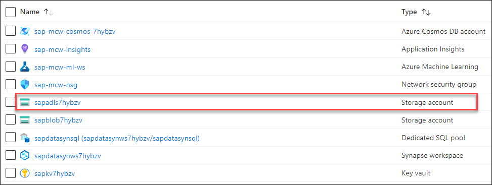

2. From the left menu, select **Access keys**. Below the **key1** heading, select the **Show** button next to the Key field. Use the Copy button in the field to record this value for a future task.

    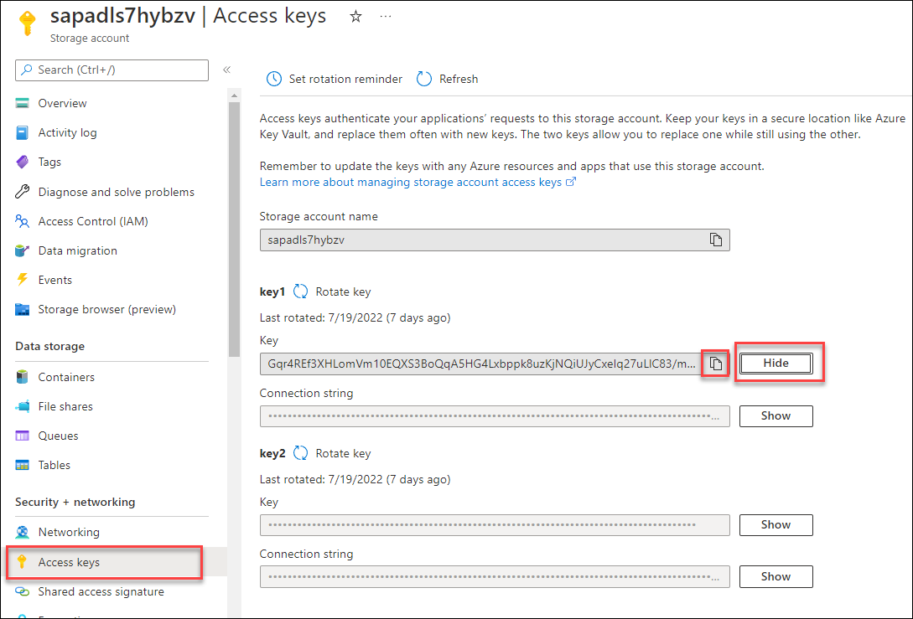

### Task 2: Create an Azure Machine Learning datastore

In this task, you will create an Azure Machine Learning datastore by configuring it to use Azure Blob Storage. You will provide necessary details such as the datastore name, storage account, and authentication key, and then create the datastore in the Azure Machine Learning workspace.

1. In the Azure Portal, open the lab resource group **sap_plus_extend_and_innovate** then search for and select the Azure Machine Learning resource **sap-ml-ws**.

    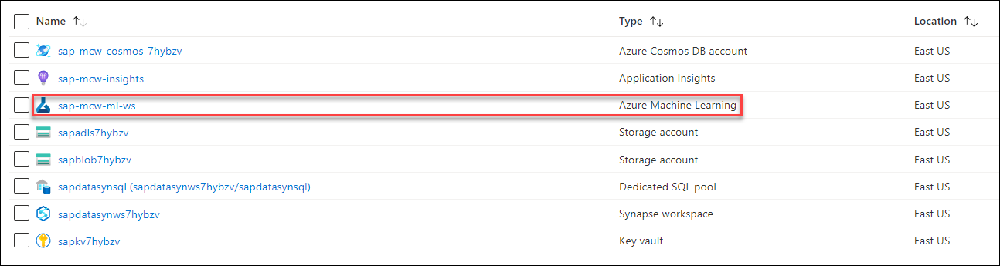

2. On the Azure Machine Learning Overview screen, select the **Studio web URL** to open the workspace.

    

3. From the left menu, select **Data** beneath the **Assets** header. On the **Data** screen, select the **Datastores** tab, then select **+ Create**.

   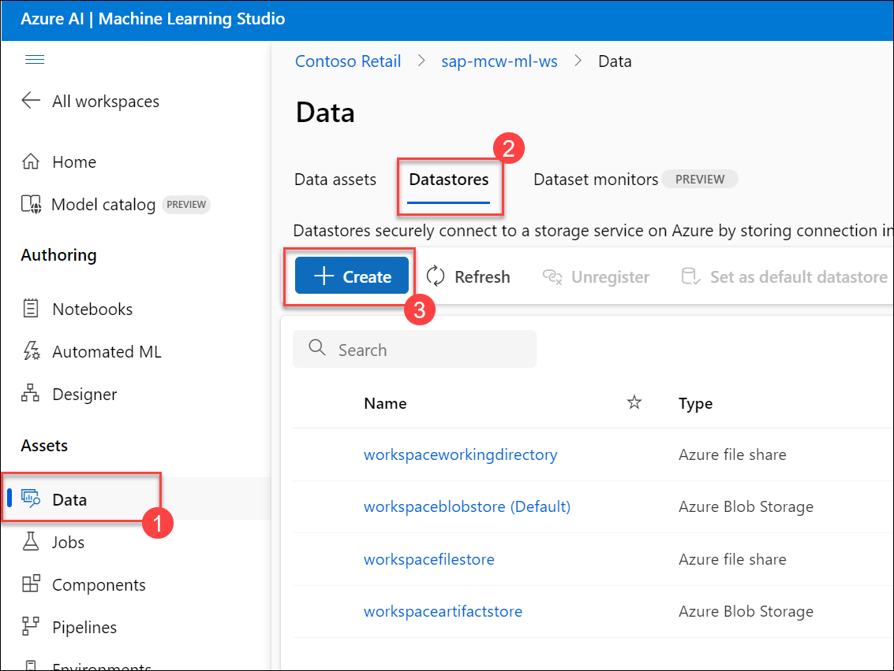

4. On the Create datastore blade, fill in the form as follows then select **Create**.

    | Field | Value |
    |-------|-------|
    | Datastore name | Enter `sales_payments_full_adls` |
    | Datastore type | Select **Azure Blob Storage** |
    | Account selection method | Select **From Azure subscription** |
    | Subscription ID | Select the lab subscription |
    | Storage account | Select **sapadls{SUFFIX}(sap_plus_extend_and_innovate)** |
    | Blob container | Select **sales-payment-parquet** |
    | Save credentials with the datastore for data access | Select **Yes** |
    | Authentication type | Select **Account key** |
    | Account key | Enter the storage account key obtained in the previous task |
    | Use workspace managed identity for data preview and profiling in Azure Machine Learning studio | Toggle off |

    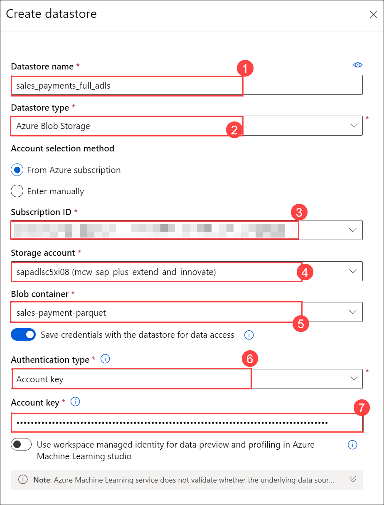

### Task 3: Create and run an Automated ML job

In this task, you will create and run an Automated Machine Learning (AutoML) job in Azure Machine Learning Studio to predict incoming cash flow. You'll configure the AutoML job, choose the dataset, set up a compute cluster, and submit the training job. After training, you will deploy the best model as a web service and monitor its deployment status until it is successfully completed.

1. In Azure Machine Learning Studio, select **Automated ML** from the left menu.

    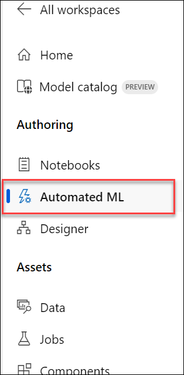

1. On the Automated ML screen, select **+ New Automated ML job** from the toolbar menu.

    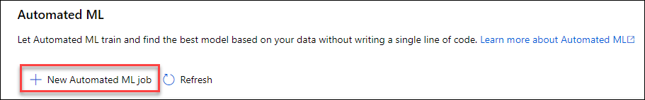

1. On the **Submit an Automated ML job** page, enter the following details:

    - **Job name**: Keep the default **(1)**
    - **New experiment name**: Enter **predict-incoming-cashflow (2)**
    - Select **Next (3)**

        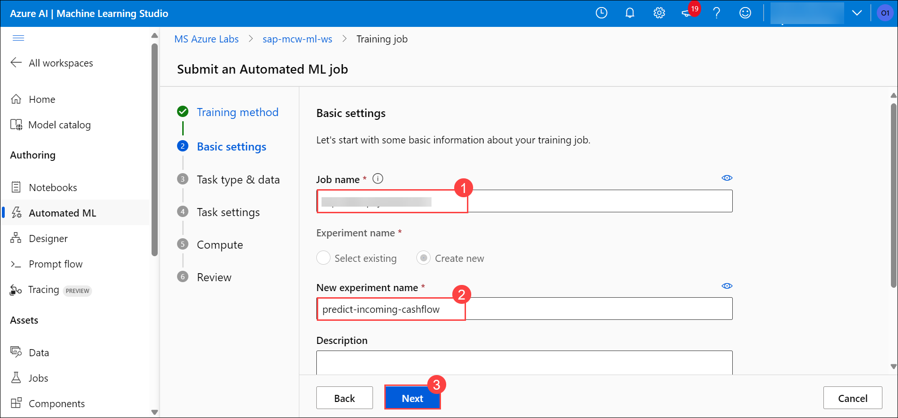

1. Under the **Task type & data** page, enter the following details:

    - **Select task type**: Select **Regression**
    - Under **Select data** select **+ Create**.

1. On the Create data asset Data type form, name the dataset `sap-sales-payments-full`, and select **Type** as **Tabular**. Select **Next**.

    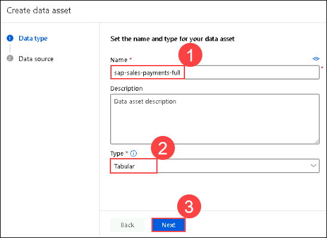

1. On the Create data asset Data source selection step, select **From Azure storage**. Select **Next**.

    .png "New data asset Data type form")

1. On the Create data asset Storage type step, select the **sales_payments_full_adls** item as the datastore. Select **Next**.

    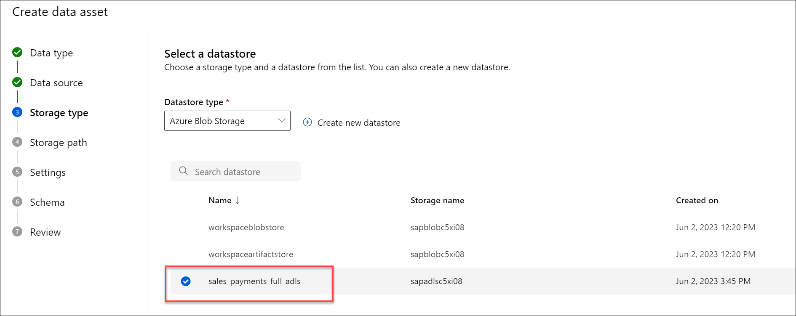

1. On the Create data asset Storage path step, select the **dbo.SalesPaymentsFull.parquet** file for the storage path. Select **Next**.

    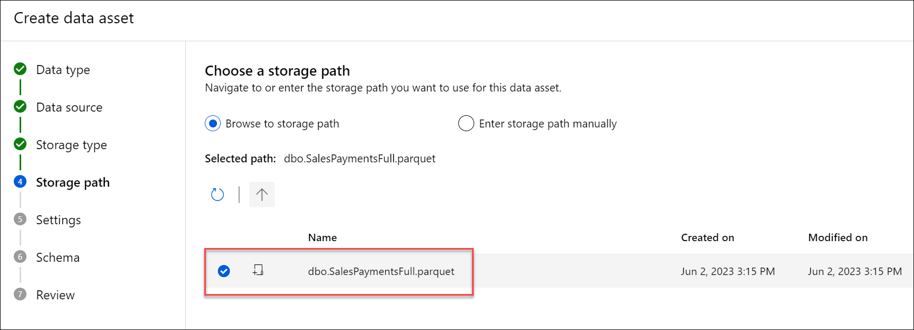  

1. On the Create data asset Settings step, review the data from the parquet file, then select **Next**.

    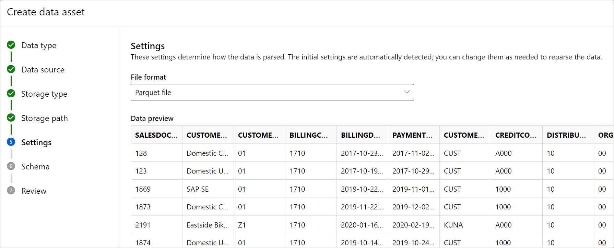

1. On the Create data asset Schema step, toggle the following fields off so that they are not included in the dataset then select **Next**:
   - SALESDOCUMENT
   - BILLINGDOCUMENTDATE
   - PAYMENTDATE
   - SALESGROUP
   - SALESOFFICE

        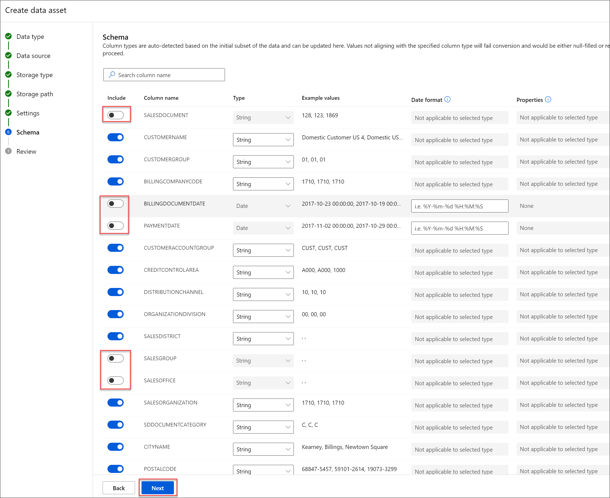

1. Review the settings and click on **Create**.

   .png "New data asset Data type form")

1. On the Select data asset step of the Create a new Automated ML job screen, refresh the data asset table.

    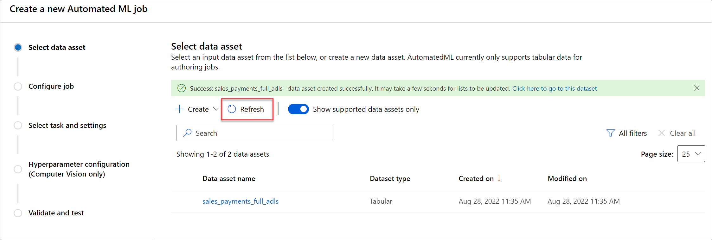

12. On the Select data asset step, select **sap-sales-payments-full** from the list and select **Next**.

    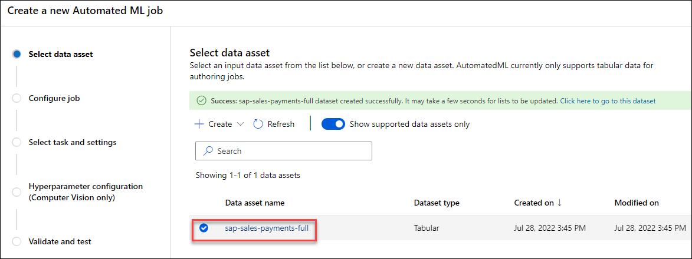

1. On the **Task settings** page, select **PAYMENTDELAYINDAYS** as a **Target column**. Select **Next**.

1. On the **Compute** page, **Select compute type** as **Compute cluster**. Select the **+ New** button below the **Select Azure ML compute cluster** field.

1. On the Create compute cluster blade Virtual machine step, accept the defaults, and select **Next**.

    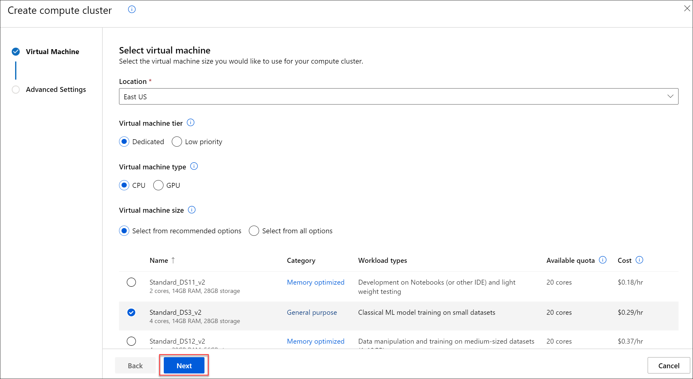

1. On the Create compute cluster blade Advanced settings, fill in the form as follows then select **Create**. It takes a few moments for the cluster to be provisioned.

    | Field | Value |
    |-------|-------|
    | Compute name | Enter `automlcompute` |
    | Maximum number of nodes | Enter `3` |

    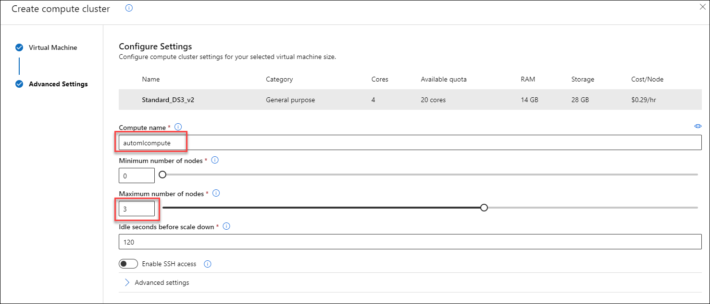

1. On the Compute job step, fill in the form as follows, then select **Next**.

    | Field | Value |
    |-------|-------|
    | Select compute type | Select **Compute cluster** |
    | Select Azure ML compute cluster | Select **automlcompute** |

1. Select **Submit training job**.

1. The job is then created and opened in the browser. Use the **Refresh** button to monitor the current state.

    

    > **Note**: Training will take approx 1-2 hours. Proceed to [Exercise 7](#exercise-7-visualize-historical-data-with-power-bi) and return here once completed.

    > **Congratulations** on completing the task! Now, it's time to validate it. Here are the steps:
    > - Hit the Validate button for the corresponding task. If you receive a success message, you can proceed to the next task. Alternatively, you can navigate to the Lab Validation Page, from the upper right corner in the lab guide section.
    > - If not, carefully read the error message and retry the step, following the instructions in the lab guide. 
    > - If you need any assistance, please contact us at labs-support@spektrasystems.com. We are available 24/7 to help you out.

      <validation step="b3e65a85-1558-4f82-b557-71b5c10517bd" />

### Task 4: Deploy the best model as a web service

1. Once the Automated ML job indicates a status of **Completed**, in the Best model summary card on the screen, select the link beneath the **Algorithm name** heading.

    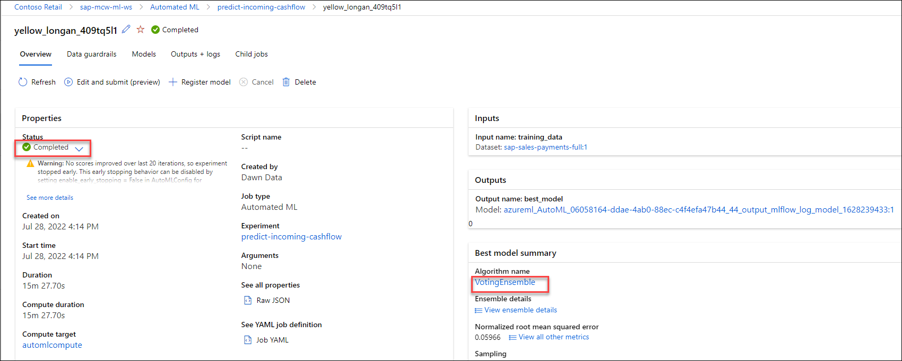

2. On the Model screen, expand the **Deploy** item in the toolbar menu and select *Web service**.

    

3. On the Deploy a model blade, complete the form as follows then select **Deploy**.

    | Field | Value |
    |-------|-------|
    | Name | Enter `predict-incoming-cashflow-svc` |
    | Compute type | Select **Azure Container Instance** |

    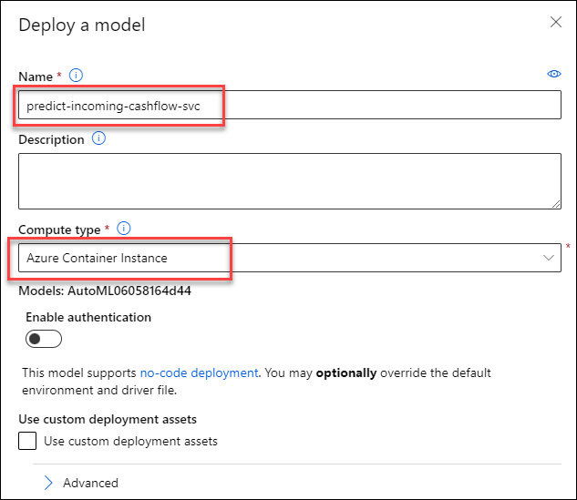

4. On the Model screen, monitor the Deploy status at the bottom of the Model summary card. It will indicate a status of **Completed** in a few minutes time. Please wait for the message to turn from **Running** to **Succeeded**.

    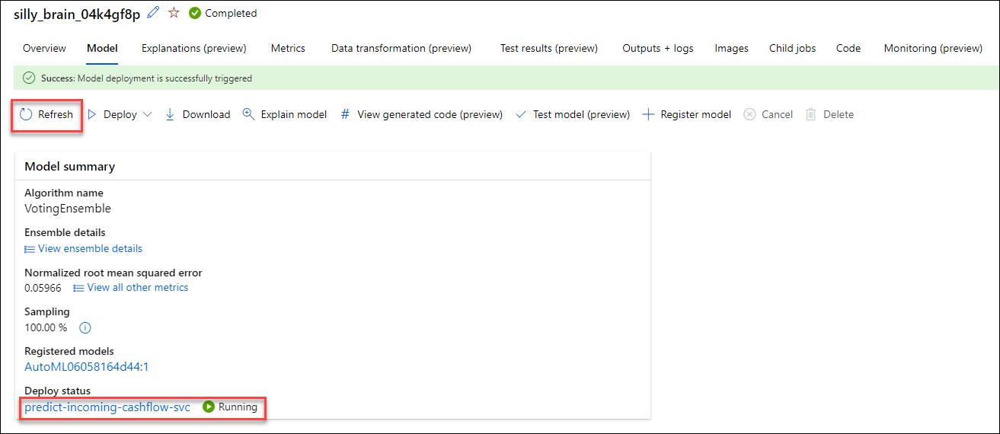

5. Select the link below **Deploy status** to go to the deployed service endpoint screen.

<!-- 6. On the predict-incoming-cashflow-svc endpoint screen, select the **Test** tab. Replace the contents of the input data with the following and select **Test**.

    ```json
    {
        "Inputs": {
            "data": [
            { 
                "CUSTOMERNAME": "Westend Cycles",
                "CUSTOMERGROUP": "Z1",
                "BILLINGCOMPANYCODE": 1710,
                "CUSTOMERACCOUNTGROUP": "KUNA",
                "CREDITCONTROLAREA": "A000",
                "DISTRIBUTIONCHANNEL": 10,
                "ORGANIZATIONDIVISION": 0,
                "SALESDISTRICT": "US0003",
                "SALESORGANIZATION": 1710,
                "SDDOCUMENTCATEGORY": "C",
                "CITYNAME": "RALEIGH",
                "POSTALCODE": "27603"
            },
            { 
                "CUSTOMERNAME": "Skymart Corp",
                "CUSTOMERGROUP": "Z2",
                "BILLINGCOMPANYCODE": 1710,
                "CUSTOMERACCOUNTGROUP": "KUNA",
                "CREDITCONTROLAREA": "A000",
                "DISTRIBUTIONCHANNEL": 10,
                "ORGANIZATIONDIVISION": 0,
                "SALESDISTRICT": "US0004",
                "SALESORGANIZATION": 1710,
                "SDDOCUMENTCATEGORY": "C",
                "CITYNAME": "New York",
                "POSTALCODE": "10007"
            }
            ]
        },
        "GlobalParameters": 1.0
    }
    ```

    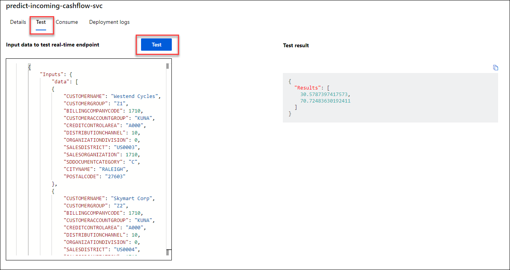 -->

## Summary

In this exercise, you have retrieved the access key for the Azure Data Lake Storage account, created an Azure Machine Learning datastore to connect to the data, and set up and ran an Automated Machine Learning job. Finally, you deployed the best model from the Automated ML job as a web service.

## You have successfully completed this exercise. Select **Next >>** to proceed to the next one.
