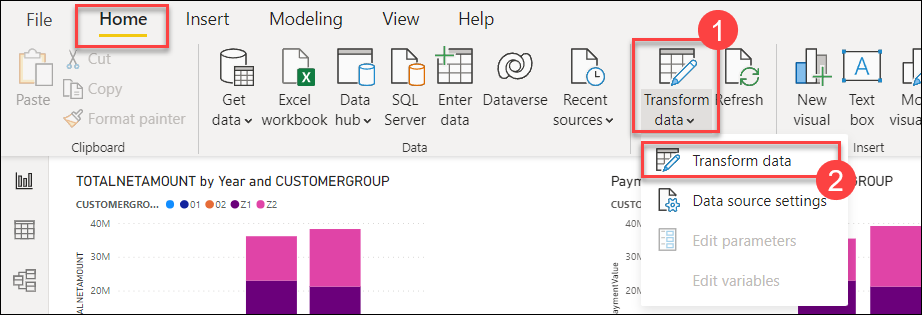
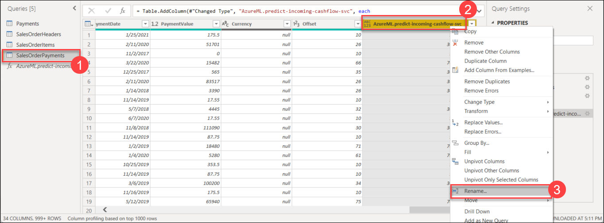
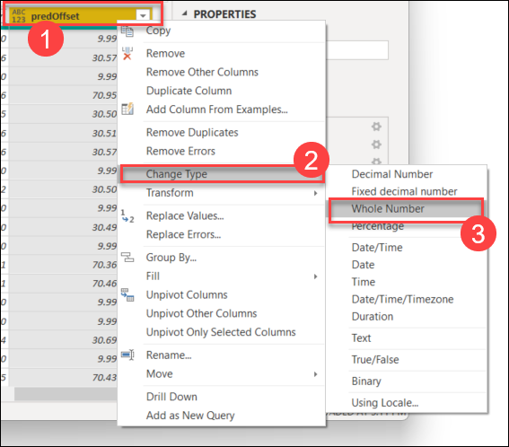
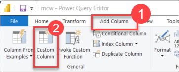
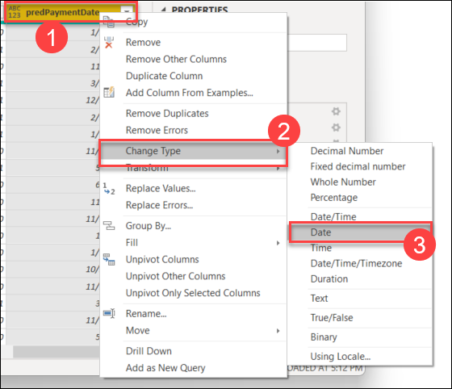
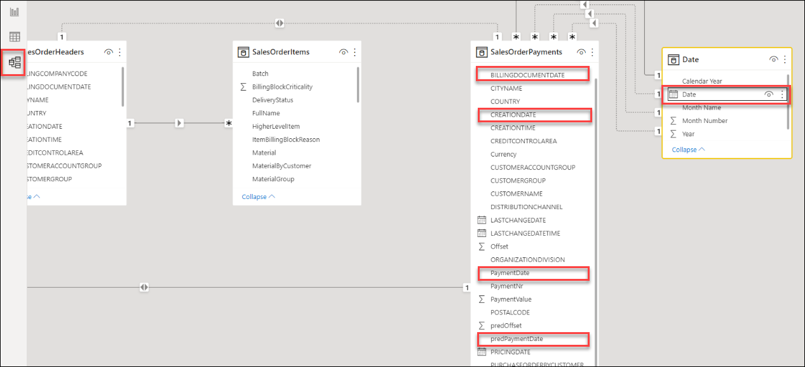
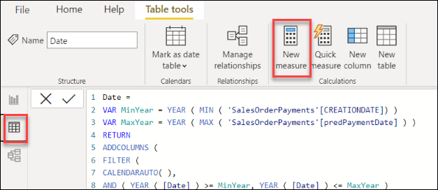
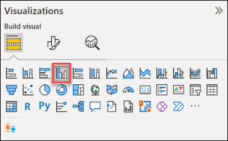

## Exercise 8: Integrate Azure Machine Learning and Power BI

### Estimated Duration: 25 minutes

## Lab Scenario

In this exercise, you will help Contoso Retail augment their Power BI report with data enriched with predictions from the machine learning model trained in [Exercise 5](#exercise-5-train-a-regression-model-to-predict-incoming-cashflow-using-azure-machine-learning-studio) to predict incoming cashflow.

## Lab Objectives

After completing this lab, you will be able to:

- Task 1: Add the deployed model to the Power BI report
- Task 2: Create a Date table for report aggregation
- Task 3: Create the Sales and Payment Forecast visualization

### Task 1: Add the deployed model to the Power BI report

In this task, you will add the deployed model to the Power BI report by connecting to the Azure Machine Learning service, integrating the model's predictions into your dataset, and creating new columns based on the model's output. This includes renaming and changing the data type of the predicted columns and applying custom transformations.

1. On the Power BI report, expand the **Transform data** item on the Home tab toolbar menu. Select **Transform data**.

   

2. In the Power Query Editor window, select the **SalesOrderPayments** table from the Queries pane and select the **Azure Machine Learning** item from the Home toolbar menu.

    

3. In the Azure Machine Learning Models dialog, select the **AzureML.predict-incoming-cashflow-svc** item, then select **OK**.

    .png "New data asset Data type form")

    >**Note**: If you are not signed in, click on **Sign in**. Enter the credentials, and select **Connect**.

    > **Note**: If the **Information is required about data privacy** message appears, select **Continue**, then check the checkbox to Ignore Privacy Levels, select **Save**.

4. In the Power Query Editor, with the SalesOrderPayments table selected in the Queries pane, scroll all the way to the right of the displayed table. Right-click the **AzureML.predict-incoming-cashflow-svc** field menu and choose to rename the field `predOffset`.

    

5. Right-click the **predOffset** column, expand the **Change Type** option, and select **Whole Number**.

    

6. On the Power Query Editor, select the **Add Column** tab, select **Custom Column**.

    

7. On the Custom Column dialog, name the new column `predPaymentDate` and set the formula to the following and select **OK**.

    ```vb
    Date.AddDays([BILLINGDOCUMENTDATE], [predOffset])
    ```

8. Right-click the new predPaymentDate and expand the **Change Type** option and choose **Date**.

    

9. Select the **Home** tab then **Close & Apply**.

    

### Task 2: Create a Date table for report aggregation

In this task, you will create a Date table in Power BI to enable aggregation of Sales and Payment figures by different dates. This involves defining a calendar table with various time slots, establishing relationships between this table and your data, and creating measures to aggregate Sales and Payments based on different date fields

Contoso retail wants to display the Sales and Payment figures aggregated by different days (BILLINGDOCUMENTDATE, predPaymentDate); this requires the creation of a calendar table with the timeslots by which to aggregate.

1. In Power BI, select the **Data view** item from the left menu.

    

2. From the Table tools menu, select **New table**.

    

3. In the formula textbox, paste the following and select the checkmark button to execute the formula and create the table.

    ```vb
    Date= 
    VAR MinYear = YEAR ( MIN ( 'SalesOrderPayments'[CREATIONDATE]) )
    VAR MaxYear = YEAR ( MAX ( 'SalesOrderPayments'[predPaymentDate] ) )
    RETURN
    ADDCOLUMNS (
    FILTER (
    CALENDARAUTO( ),
    AND ( YEAR ( [Date] ) >= MinYear, YEAR ( [Date] ) <= MaxYear )
    ),
    "Calendar Year", "CY " & YEAR ( [Date] ),
    "Year", YEAR ( [Date] ),
    "Month Name", FORMAT ( [Date], "mmmm" ),
    "Month Number", MONTH ( [Date] ),
    "Year & Month", YEAR([Date]) & " - " & FORMAT ( [Date], "mmmm" )
    )
    ```

    

4. From the left menu, select the **Model view** option. Establish the following relationships from the **Date.Date** field using drag and drop to the following table.fields:
   - SalesOrderPayments.BILLINGDOCUMENTDATE
   - SalesOrderPayments.CREATIONDATE
   - SalesOrderPayments.Payments.PaymentDate
   - SalesOrderPayments.predPaymentDate

    

5. Select the **Data view** from the left-hand menu once more, and in the Table tools menu select the **New measure** button.

    

6. In the formula textbox paste the following code then select the checkmark button to execute the formula and create the measure. Verify the new measure displays in the Fields pane.

   ```vb
   Sales at CreationDate = sum('SalesOrderPayments'[TOTALNETAMOUNT])
   ```

    

7. Repeat steps 5 and 6 and create new measures with the following formulas.

    ```vb
    Sales at BillingDate = CALCULATE(sum(SalesOrderPayments[TOTALNETAMOUNT]),USERELATIONSHIP('Date'[Date],SalesOrderPayments[BILLINGDOCUMENTDATE]))
    ```

    ```vb
    Payment at Actual Date = CALCULATE(sum('SalesOrderPayments'[Payments.PaymentValue]), USERELATIONSHIP('Date'[Date],SalesOrderPayments[Payments.PaymentDate]))
    ```

    ```vb
    Payment at pred Date = CALCULATE(sum('SalesOrderPayments'[Payments.PaymentValue]), USERELATIONSHIP('Date'[Date], SalesOrderPayments[predPaymentDate]))
    ```

### Task 3: Create the Sales and Payment Forecast visualization

In this task, you will create a Sales and Payment Forecast visualization in Power BI. This involves selecting the Clustered Column Chart visualization, configuring it to display data aggregated by different date fields, and adding measures for Sales and Payments to the chart's Y-axis to visualize forecasted trends.

1. From the left menu, select the **Report view** item.

    

2. In the Visualizations pane, select **Clustered Column Chart**. Drag-and-drop the **Date.Date** field to the **X-axis** box. Drag-and-drop the **Date.Sales at Billing Date**, **Date.Payment at pred Date**, and **Date.Payment at Actual Date** to the **Y-axis** box. The rendered visualization is shown below in the screenshot of the settings.

    

    .png "Clustered Column Chart")

## Summary

In this exercise, you added the deployed model to the Power BI report, created a Date table for aggregation, and developed a Sales and Payment Forecast visualization.

## You have successfully completed this exercise. Select **Next >>** to proceed to the next one.
