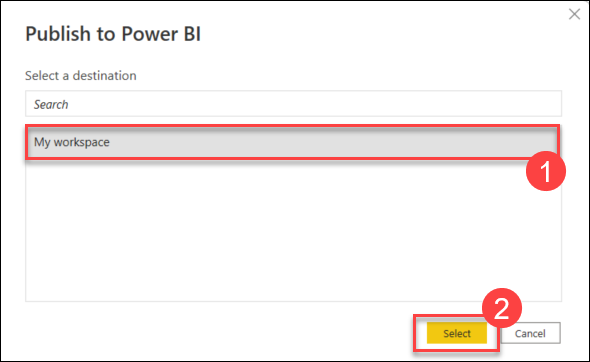

## Exercise 9: Create an alert in Power BI

### Estimated Duration: 30 minutes

## Lab Scenario

In this exercise, you will leverage both Power BI and Power Automate subscriptions to set up a comprehensive alert system. Specifically, you will create a data-driven alert in Power BI that triggers a Power Automate flow. This flow will then automatically send an email notification based on the conditions defined in the alert, allowing for real-time monitoring and response to key data changes.

## Lab Objectives

After completing this lab, you will be able to:

- Task 1: Publish the Power BI report to an online workspace
- Task 2: Create a gauge visualization to be used as the notification trigger
- Task 3: Create an alerting dashboard to send email with Power Automate

### Task 1: Publish the Power BI report to an online workspace

In this task, you will publish the Power BI report to an online workspace. First, ensure that the report file is saved. Then, on the Power BI Home tab, select the Publish option. In the Publish to Power BI dialog, choose My workspace as the destination and click Select. After publishing, wait for the process to complete and then select the link to open the report in a browser window.

1. Ensure the Power BI report file is saved. In this example, we've saved it with the name **sap.pbix**.

2. On the Power BI Home tab menu, select **Publish**.

   

3. On the Publish to Power BI dialog, select **My workspace (1)** as the destination and choose the **Select (2)** button.

    

4. Wait a few moments for the publishing to complete. Select the **Open '{REPORT NAME}.pbix' in Power BI** link. The report will open in a browser window.

    

### Task 2: Create a gauge visualization to be used as the notification trigger

In this task, you will create a gauge visualization for the notification trigger. Open the Power BI report in edit mode, add a gauge visualization, and set SalesOrderPayments.predOffset as the value with its aggregation set to Maximum. Switch to Reading view and save your changes.

1. In the online Power BI report editor in the web browser, select the **Edit** button from the top toolbar menu.

    .png "Edit report")

2. In the Visualizations pane, select **Gauge**. Drag and drop the **SalesOrderPayments.predOffset** from the Data pane to the **Value** box. Expand the **Value** field using the chevron menu and select **Maximum**.

    

3. From the toolbar menu, select **Reading view**. Save the changes when prompted.

    

    

### Task 3: Create an alerting dashboard to send email with Power Automate

In this task, you will set up an alerting dashboard to send an email via Power Automate. Pin the Gauge visualization to a new dashboard called Alerting Dashboard, then configure an alert rule to trigger when the gauge value falls below a specified threshold. Use Power Automate to create a flow that sends an email notification when the alert is triggered. Save the flow to complete the setup.

1. On the report, select to **Pin** the Gauge visualization to a new dashboard.

    

2. On the **Pin to dashboard** dialog, select **New dashboard** and enter the name `Alerting Dashboard` and select **Pin**.

    

3. From the left menu, select **My workspace**, then in the listing of items select **Alerting Dashboard**.

   .png "Open Alerting Dashboard")

4. On the gauge visualization, expand the ellipsis menu and choose **Manage alerts**.

    

5. On the Manage alerts blade, select **+ Add alert rule**.

    

6. Set the condition to trigger when the threshold is **lower than the value currently indicated in the gauge**, this will ensure it triggers immediately. Set the maximum notification frequency to once per hour. Near the bottom of the blade select the **Use Microsoft Power Automate to trigger additional actions** link.

    .png "Setup alert")

7. You may see a new web browser tab open displaying an overview of a Power Automate Template. Select **Try it now** beneath the **Trigger a flow with a Power BI data-driven alert**. Sign in if required.

    

8. Briefly switch back to the **Manage alerts** pane on the Alerting Dashboard tab of the web browser and select **Save and close**. Return to the Power Automate flow tab.

9. On the Trigger a flow with a Power BI data-driven alert screen, select **Sign in** on the **This flow will connect to field**. Once signed in, select **Continue**.

    

10. In the flow designer, in the When a data driven alert is triggered step, expand the Alert Id field, and select **Max of predOffset**.

    

11. Select **+**, click on **Add an action**.

    

12. Search for `send email`. From the results select **Send an email (V2) - Office 365 Outlook**.

    

13. On the create a connection pane, click on **Sign in** and use your credentials for signing in.

    

14. In the **To** field, enter your email address and for **Subject** click on the symbol that will display Dynamic content pane.

    

15. In the Dynamic content pane, select **Alert title**.

    

14. Select the **Body** text box and in the Dynamic content pane select **Tile URL**.

    

15. At the bottom of the flow designer select **Save**.

    

16. An email is sent to the email address from the trigger.

    

    > **Note**: To retrigger the alert a data update must occur. Execute the following SQL script in the dedicated SQL pool of Azure Synapse Analytics to change data.

    ```SQL
    UPDATE dbo.Payments SET PaymentDate = DATEADD(DAY, 1, PaymentDate)
    ```

## Summary

In this exercise, you published the Power BI report to an online workspace and created a gauge visualization for use as a notification trigger. You then set up an alerting dashboard in Power BI and configured it with Power Automate to send email notifications when specific conditions were met.

## You have successfully completed this exercise. Select **Next >>** to proceed to the next one.
