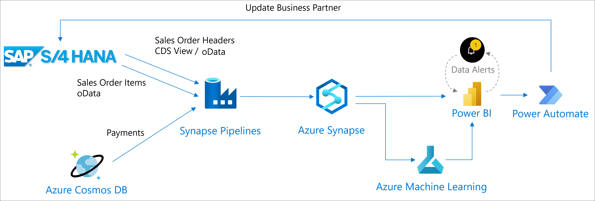
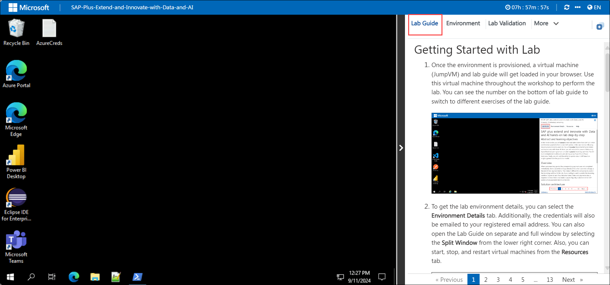
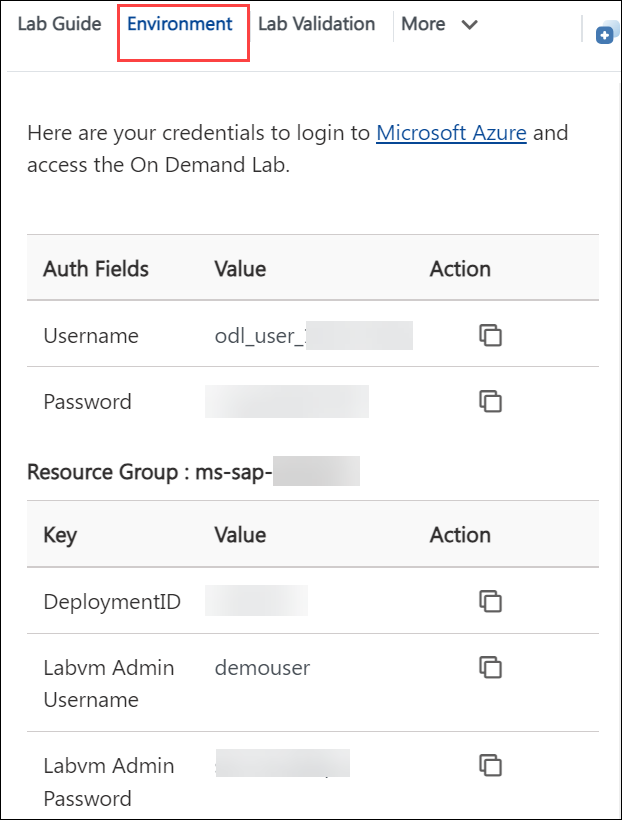
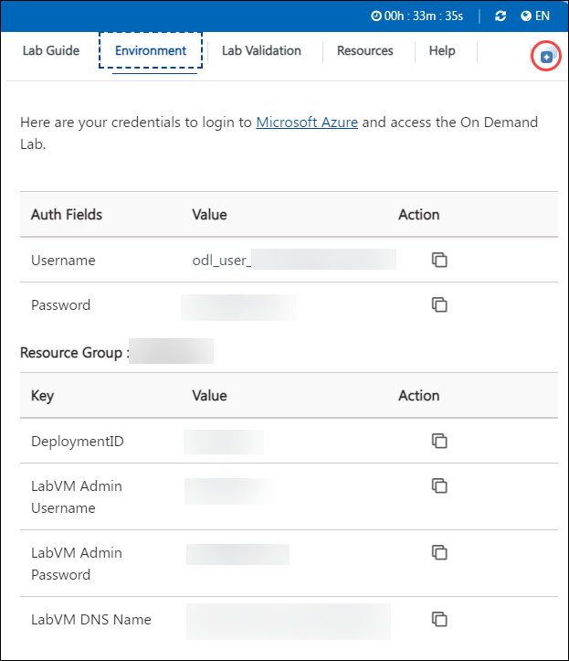

# SAP plus extend and innovate with Data and AI

## Overview 

This lab is intended for developers and IT professionals looking to explore SAP's capabilities in extending and innovating with Data and AI. Participants will learn how to integrate SAP systems with AI-driven solutions, leveraging data to enhance business processes and decision-making. The hands-on lab will guide users step-by-step through connecting SAP to AI services, extracting and processing data, and building intelligent applications. Through practical exercises, users will gain insights into SAP’s integration with AI tools to drive innovation in enterprise operations.

## Objective 

This lab is designed to equip participants with hands-on experience in integrating SAP systems with AI technologies, enabling data extraction, processing, and the creation of intelligent applications. Participants will gain the skills to extend SAP functionality and drive business innovation using AI-powered solutions. By completing this lab, participants will learn to: 

1. **Understand how to extend SAP systems with AI-driven solutions**: Gain a clear understanding of SAP’s extensibility through AI, learning how artificial intelligence can be applied to enhance core SAP functionalities. The lab will explore methods to automate processes, derive insights, and improve decision-making by integrating AI with existing SAP systems.

2. **Learn how to integrate SAP with external AI services**: This objective focuses on establishing connections between SAP and various AI services such as machine learning models, natural language processing (NLP), and computer vision APIs. Participants will follow step-by-step instructions to configure and enable seamless data flow between SAP environments and AI platforms like SAP AI Core, TensorFlow, or other third-party solutions.

3. **Gain hands-on experience in data extraction and processing from SAP systems**: Users will learn how to extract relevant data from SAP systems, such as SAP S/4HANA, and preprocess this data to make it suitable for AI models. The lab will cover essential techniques for data wrangling, transformation, and preparation, ensuring smooth integration with AI algorithms.

4. **Build intelligent applications using SAP data and AI technologies**: Through guided exercises, participants will develop AI-powered applications that interact with SAP data. These intelligent applications may include predictive analytics, automated recommendations, or advanced analytics dashboards. The goal is to demonstrate how AI can deliver meaningful insights and value to business processes using SAP as the data foundation.

5. **Explore practical use cases for enhancing business processes and decision-making with AI**: The lab will provide real-world examples and use cases where AI has been successfully applied to improve operational efficiency, customer experience, supply chain management, and other business areas. These practical examples will help participants understand how to apply the concepts learned in real-life SAP scenarios.

6. **Develop skills to innovate and optimize enterprise operations through SAP's data and AI integration**: By the end of the lab, users will have the technical know-how to implement AI-driven innovations within SAP environments. They will learn how to optimize enterprise workflows, reduce manual tasks, and enhance operational efficiency by leveraging the combined power of SAP’s robust data systems and advanced AI technologies. This will equip participants to lead AI-powered transformation projects in their organizations.

## Prerequisites 

Participants should have: 
Basic knowledge and understanding of the following
 
 - Basic Knowledge of SAP Systems
 - Experience with Programming
 - Understanding of AI and Machine Learning Concepts

## Architecture 

- **Basic Knowledge of SAP Systems**: Participants should have a foundational understanding of SAP’s core modules and functionalities, such as SAP S/4HANA, SAP BW (Business Warehouse), or SAP HANA. This includes familiarity with how data is stored, retrieved, and managed within the SAP ecosystem. Experience in navigating the SAP interface, accessing transactional and analytical data, and understanding business processes in SAP (like finance, logistics, and supply chain) will be beneficial for working with AI models and integrating data.

- **Experience with Programming**: To effectively interact with AI services and SAP systems, participants should be comfortable with at least one programming language. Knowledge of Python is essential as it is widely used in AI and data science for building machine learning models and handling data pipelines. Java or ABAP (SAP's proprietary programming language) can be beneficial when customizing SAP applications or integrating SAP systems with external AI services. This lab may involve writing scripts to extract and preprocess data, connect APIs, and execute AI-driven workflows.

- **Understanding of AI and Machine Learning Concepts**: A basic understanding of artificial intelligence (AI) and machine learning (ML) concepts is crucial. Participants should be familiar with terms like supervised and unsupervised learning, data models, algorithms, and neural networks. Knowing how AI models are trained, validated, and deployed will help users better understand how SAP integrates with AI platforms. Familiarity with AI tools such as TensorFlow, scikit-learn, or SAP’s AI services will aid in building intelligent applications and optimizing SAP workflows using predictive analytics or automation.

## Architecture Diagram: 

  

## Explanation of Components 

1. **SAP S/4HANA**: Participants should have a foundational understanding of enterprise resource planning (ERP) systems and a basic familiarity with data management concepts to fully grasp SAP S/4HANA. This integrated ERP suite is designed to streamline business processes by utilizing the advanced in-memory computing power of SAP HANA. It covers key business functions such as finance, supply chain, and manufacturing, offering real-time insights and enhanced efficiency. With its modern, intuitive interface and robust analytics capabilities, SAP S/4HANA supports digital transformation and agile decision-making, enabling organizations to adapt swiftly to evolving market demands and improve overall operational effectiveness.

2. **Azure Synapse**: is a powerful data integration and analytics service. Participants should have a basic understanding of its key components, including data integration (through Synapse Pipelines), data warehousing (using SQL Pools), and real-time analytics. The lab may involve extracting data from SAP systems and integrating it into **Azure Synapse** for large-scale data analytics and processing. Experience with SQL and working knowledge of connecting external data sources to Synapse will be beneficial.

3. **Power BI**: is a data visualization and business intelligence tool. Participants should know how to use Power BI to create reports and dashboards by connecting to SAP data sources and other data sets. This lab may involve building interactive visualizations and dashboards based on the data extracted from SAP systems and analyzed through AI models. A basic understanding of Power BI’s workspace, DAX formulas, and data transformation capabilities will be helpful.

4. **Azure Machine Learning** is a cloud-based platform that provides tools for building, training, and deploying machine learning models. Participants should have a basic understanding of AI and machine learning concepts, such as supervised and unsupervised learning, model training, and evaluation. Familiarity with **Azure Machine Learning** will allow participants to integrate AI models with SAP data for predictive analytics, automation, or decision-making processes within SAP systems. Experience with setting up Azure ML workspaces, using Jupyter notebooks, or deploying models in Azure will be advantageous.

5. **Azure Cosmos DB**: is a globally distributed, multi-model database service. Participants should have a basic understanding of how **Cosmos DB** works, especially its NoSQL architecture, partitioning, and querying data using SQL-like syntax. The lab may involve storing and managing SAP-related unstructured or semi-structured data in **Azure Cosmos DB** to support scalable, high-performance applications that integrate AI-driven insights into business processes. Familiarity with working on Cosmos DB’s APIs (such as SQL, MongoDB, or Cassandra) and its integration with AI services is beneficial.

6. **Power Automate**: Participants should have a basic understanding of workflow automation and process optimization to effectively utilize Power Automate. This cloud-based service from Microsoft enables users to automate repetitive tasks and streamline processes across various applications and services without requiring extensive coding knowledge. By connecting disparate systems through pre-built or custom workflows, Power Automate helps integrate data, manage approvals, and trigger actions based on specific conditions. Its user-friendly interface and extensive library of connectors facilitate seamless automation, enhancing productivity and efficiency by allowing users to focus on higher-value tasks and ensuring consistent execution of routine processes.

# Getting Started
 
Welcome to your SAP Plus Extend and Innovate with Data and AI Workshop! We've prepared a seamless environment for you to explore and learn about SAP's "Plus: Extend and Innovate with Data and AI" initiative. This program is designed to help businesses leverage SAP's powerful data management tools and cutting-edge AI technologies. By integrating intelligent solutions, it empowers users to optimize operations, drive innovation, and extend their capabilities beyond traditional ERP functions, fostering smarter decision-making and improved business outcomes. Through this initiative, organizations can unlock new opportunities by harnessing the potential of data and AI within SAP’s ecosystem. Let's begin by making the most of this experience:
 
## Accessing Your Lab Environment
 
1. Once you're ready to dive in, your virtual machine and lab guide will be right at your fingertips within your web browser.

     

 ### Virtual Machine & Lab Guide
 
   Your virtual machine is your workhorse throughout the workshop. The lab guide is your roadmap to success.
 
## Exploring Your Lab Resources
 
1. To get a better understanding of your lab resources and credentials, navigate to the **Environment** details tab.

 
   
 
## Utilizing the Split Window Feature
 
1. For convenience, you can open the lab guide in a separate window by selecting the **Split Window** button from the Top right corner.

   
 
## Managing Your Virtual Machine

1. Feel free to **start, stop, or restart (2)** your virtual machine as needed from the **Resources (1)** tab. Your experience is in your hands!

   

## **Let's Get Started with Azure Portal**
 
1. On your virtual machine, click on the Azure Portal icon as shown below:
 
    
 
2. You'll see the **Sign into Microsoft Azure** tab. Here, enter your credentials:
 
   - **Email/Username:** <inject key="AzureAdUserEmail"></inject>
 
        
 
3. Next, provide your password:
 
   - **Password:** <inject key="AzureAdUserPassword"></inject>
 
        
 
4. If you see the pop-up **Stay Signed in?**, click **No**.

    

5. If you see the pop-up **You have free Azure Advisor recommendations!**, close the window to continue the lab.

6. If a **Welcome to Microsoft Azure** popup window appears, click **Maybe Later** to skip the tour.
   
7. Now, click on the **Next** from the lower right corner to move to the next page.

     

## **Support Contact**

1. The CloudLabs support team is available 24/7, 365 days a year, via email and live chat to ensure seamless assistance at any time. We offer dedicated support channels tailored specifically for both learners and instructors, ensuring that all your needs are promptly and efficiently addressed.

   Learner Support Contacts:

    - Email Support: labs-support@spektrasystems.com
    - Live Chat Support: https://cloudlabs.ai/labs-support

2. Click **"Next"** from the bottom right corner to embark on your Lab journey!

   >**Note:** Do not close the PowerShell in which logon task is running.
 
### Happy Learning!!
